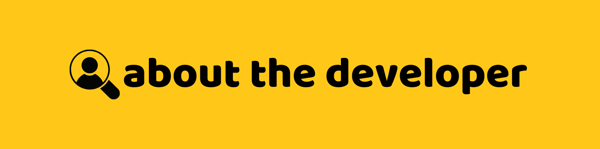

## Project Overview
**HearDrop** is a console-based donation matching system aimed at connecting donors with recipients. This project aligns with two Sustainable Development Goals:
- **SDG 2: Zero Hunger** 🥗
- **SDG 12: Responsible Consumption and Production** ♻️

The system simplifies the donation process, ensuring efficient distribution of resources and minimizing waste.

---

## Table of Contents 📚
1. [Features](#features)
   - [Donor Features](#donor-features)
   - [Recipient Features](#recipient-features)
2. [How It Works](#how-it-works)
   - [User Registration](#step-1-user-registration)
   - [User Login](#step-2-user-login)
   - [Donor Workflow](#step-3-donor-workflow)
   - [Recipient Workflow](#step-4-recipient-workflow)
   - [Database Management](#step-5-database-management)
   - [Status Updates](#step-6-status-updates)
3. [Tech Used](#tech-used)
4. [OOP Principles](#oop-principles)
   - [Encapsulation](#encapsulation)
   - [Inheritance](#inheritance)
   - [Polymorphism](#polymorphism)
   - [Abstraction](#abstraction)
5. [Setup Instructions](#setup-instructions)
   - [Prerequisites](#prerequisites)
   - [Installation](#installation)
6. [System Modules](#system-modules)
   - [System Directory Structure](#system-directory-structure)
   - [Directory Explanation](#directory-explanation)
   - [Classes](#classes)
7. [SDG Implementation](#sdg-implementation)
8. [Future Enhancements](#future-enhancements)
9. [Contributors](#contributors)
10. [Back to Top](#project-overview)

---
## Features 


### Donor Features 
| **Feature**           | **Description**                                                                 |
|-----------------------|---------------------------------------------------------------------------------|
| **Donate Item**          | Add donation details such as item name, description, quantity, and pickup location. |
| **View My Donated Items** | See a list of your donations and their statuses.                                |
| **Edit Donated Items**    | Update item details or pickup locations.                                        |
| **Remove Donated Items**  | Remove your donations (can only be used if the donation status is still available). |


### Recipient Features 
| **Feature**            | **Description**                                                                 |
|------------------------|---------------------------------------------------------------------------------|
| **View Available Donations** | Browse donations listed by donors that are still available to be reserved or claimed. |
| **Reserve Item**          | Reserve an item with a specified pickup time.                                  |
| **View My Reserved Items** | Track reserved items and their pickup details.                                 |
| **Remove My Reserved Items** | Remove your reserved donations from your reservation list; the items will be updated as available again. |

[Back to Top](#project-overview)

---
## How It Works 


### Step 1: User Registration  
- Users register to the system with a unique username and a password.


### Step 2: User Login  
- Users log in with their registered credentials, then selecting their role as: **Donor** or **Recipient**.


### Step 3: Donor Workflow  
1. **Add Donation**: Donors provide item details (e.g., name, description, quantity, and pickup location).

  

2. **View Donations**: Track all donated items and their statuses (available, reserved, etc.).

   

3. **Edit Donations**: Modify item details or update pickup location.

 

4. **Remove Donations**: Remove donated items as long as they are available.

 

### Step 4: Recipient Workflow  
1. **View Donations**: Recipients browse available donations.

 

2. **Reserve Items**: Reserve an item and specify a pickup time.

 

3. **Track Reservations**: View reserved items and their pickup details.

 

4. **Remove Reservations**: Remove reserved items.

 

### Step 5: Database Management  
- All user and donation data are stored in MySQL tables, ensuring persistence and integrity.


### Step 6: Status Updates  
- Reserved items are marked with the recipient's username and pickup schedule.  
- Donors can view the updated status of their donations.


[Back to Top](#project-overview)

---
## Tech Used 


- **Programming Language**: Java ☕
- **Database Management System**: MySQL 🛢️🐬
- **Utilities**: Java JDBC (Java SQL Connector)

[Back to Top](#project-overview)

---
## OOP Principles 


### Encapsulation
Encapsulation restricts direct access to some of an object's components, ensuring sensitive data is private and accessible through getter and setter methods. 

Example: `User` class `username` and `password`
```java
public class User {
    private String username;
    private String password;

    public User(String username, String password) {
        this.username = username;
        this.password = password;
    }

    public String getUsername() {
        return username;
    }

    public void setUsername(String username) {
        this.username = username;
    }

    public String getPassword() {
        return password;
    }

    public void setPassword(String password) {
        this.password = password;
    }
}
```
- By making the `username` and `password` fields private and providing public getters and setters, we control how these attributes are accessed and modified.
---
### Inheritance
Inheritance allows a class to derive properties and behaviors from another class.

Example: `DonationDAO` and `UserDAO` Classes Extending `BaseDAO`

- `BaseDAO.java`
```java
public abstract class BaseDAO {
    private Connection connection;

    public BaseDAO() {
        connection = HearDropDB.getConnection();
    }

    protected abstract Object mapResultSetToObject(ResultSet rs) throws SQLException;

    // Other common CRUD operations
}
```
- `DonationDAO` extends `BaseDAO`
```java
public class DonationDAO extends BaseDAO {

    @Override
    protected Donation mapResultSetToObject(ResultSet rs) throws SQLException {
        return new Donation(
            rs.getInt("id"),
            rs.getInt("donor_id"),
            rs.getString("item_name"),
            rs.getString("description"),
            rs.getInt("quantity"),
            rs.getString("pickup_location"),
            rs.getString("status"),
            rs.getString("recipient_username"),
            rs.getString("pickup_datetime"),
            rs.getString("donor_username")
        );
    }

    // Other methods specific to donations
}
```
- `UserDAO` extends `BaseDAO`
```java
public class UserDAO extends BaseDAO {

    @Override
    protected User mapResultSetToObject(ResultSet rs) throws SQLException {
        User user = new User();
        user.setId(rs.getInt("id"));
        user.setUsername(rs.getString("username"));
        user.setPassword(rs.getString("password"));
        return user;
    }

    // Other methods specific to users
}
```
- Both `DonationDAO` and `UserDAO` inherit the common database operations from `BaseDAO` but provide their specific implementations for mapping result sets to their respective objects.
---
### Polymorphism
Polymorphism allows one interface to be used for different data types or objects. Methods in derived classes can override the parent class's methods to provide specific implementations.

Example: `DonorMenu` and `RecipientMenu` overriding `displayMenu` from `BaseMenu`

- `BaseMenu`
```java
public abstract class BaseMenu {
    protected static Scanner scanner = new Scanner(System.in);

    public abstract void displayMenu();

    public abstract void handleChoice(int choice);

    public void show() {
        while (true) {
            displayMenu();
            System.out.print("Enter your choice: ");
            int choice = Integer.parseInt(scanner.nextLine());

            if (choice == getExitChoice()) {
                return;
            }

            handleChoice(choice);
        }
    }

    protected abstract int getExitChoice();
}

```
- `DonorMenu` and `RecipientMenu` overriding `displayMenu`
```java
public class DonorMenu extends BaseMenu {
    @Override
    public void displayMenu() {
        DesignUtils.printHeader("donor", username);
        System.out.println("\n--- Donor Menu ---\n");
        System.out.println("1. Donate Item");
        System.out.println("2. View My Donated Items");
        System.out.println("3. Edit Donated Items");
        System.out.println("4. Remove Donated Item");
        System.out.println("5. Back to Main Menu");
    }

    @Override
    public void handleChoice(int choice) {
        switch (choice) {
            case 1:
                donorService.donateItem(donorId, username);
                break;
            case 2: 
                donorService.viewMyDonatedItems(donorId);
                break;
            case 3:
                donorService.editDonatedItem(donorId);
                break;
            case 4:
                donorService.removeDonatedItem(donorId);
                break;
            default: 
                System.out.println("Invalid choice. Please try again.");
        }
    }

    @Override
    protected int getExitChoice() {
        return 5;
    }
}

public class RecipientMenu extends BaseMenu {
    @Override
    public void displayMenu() {
        DesignUtils.printHeader("recipient", recipientUsername);
        System.out.println("\n--- Recipient Menu ---\n");
        System.out.println("1. View Available Items");
        System.out.println("2. Reserve Item");
        System.out.println("3. View My Reserved Items");
        System.out.println("4. Remove Reserved Item");
        System.out.println("5. Back to Main Menu");
    }

    @Override
    public void handleChoice(int choice) {
        switch (choice) {
            case 1: 
                recipientService.viewAvailableItems();
                break;
            case 2: 
                recipientService.reserveItem(recipientUsername);
                break;
            case 3: 
                recipientService.viewMyReservedItems(recipientUsername);
                break;
            case 4: 
                recipientService.removeReservedItem(recipientUsername);
                break;
            default: 
                System.out.println("Invalid choice. Please try again.");
        }
    }

    @Override
    protected int getExitChoice() {
        return 5;
    }
}
```
- When calling `show()`
```java
    BaseMenu donorMenu = new DonorMenu(user.getId(), user.getUsername());
    donorMenu.show();

    BaseMenu recipientMenu = new RecipientMenu(user.getUsername());
    recipientMenu.show(); 
```

- By defining `BaseMenu` as the reference type for both `DonorMenu` and `RecipientMenu`, the same interface (i.e., `show()`) can be used to call different implementations of `displayMenu()` and `handleChoice()`, depending on the actual object type. This allows for dynamic behavior, where the menu is displayed differently for donors and recipients, even though they are both being handled by the `BaseMenu` reference.
---
### Abstraction
Abstraction hides implementation details from the user and only exposes essential functionalities.

Example: `BaseDAO` implementing abstraction
```java
public abstract class BaseDAO {
    private Connection connection;

    public BaseDAO() {
        connection = HearDropDB.getConnection();
    }

    protected abstract Object mapResultSetToObject(ResultSet rs) throws SQLException;

    public boolean add(String query, Object... params) {
        try (PreparedStatement stmt = connection.prepareStatement(query)) {
            setParameters(stmt, params);
            return stmt.executeUpdate() > 0;
        } catch (SQLException e) {
            System.out.println("Error: Unable to execute the add operation.");
            logError("Add operation error", e);
        }
        return false;
    }

    public <T> T getById(String query, Class<T> clazz, Object... params) {
        try (PreparedStatement stmt = connection.prepareStatement(query)) {
            setParameters(stmt, params);
            ResultSet rs = stmt.executeQuery();
            if (rs.next()) {
                return clazz.cast(mapResultSetToObject(rs));
            } else {
                System.out.println("No record found for the given criteria.");
            }
        } catch (SQLException e) {
            System.out.println("Error: Unable to retrieve the record.");
            logError("GetById operation error", e);
        }
        return null;
    }

    // Other CRUD methods
}

```
- `DonationDAO` implementing mapResultSetToObject method
```java
public class DonationDAO extends BaseDAO {

    @Override
    protected Donation mapResultSetToObject(ResultSet rs) throws SQLException {
        return new Donation(
            rs.getInt("id"),
            rs.getInt("donor_id"),
            rs.getString("item_name"),
            rs.getString("description"),
            rs.getInt("quantity"),
            rs.getString("pickup_location"),
            rs.getString("status"),
            rs.getString("recipient_username"),
            rs.getString("pickup_datetime"),
            rs.getString("donor_username")
        );
    }

    // Other methods specific to donations
}

```

- `BaseDAO` abstracts common database operations like `add`, `getById`, `getList`, `update`, and `remove`, but the actual logic of mapping a `ResultSet` to a specific object (like `Donation` or `User`) is left to be implemented by subclasses. This approach encapsulates database operations while allowing specific entity classes to define how their data is mapped from the database.

[Back to Top](#project-overview)

---
## Setup Instructions 


### Prerequisites
You must have downloaded and has set-up the following in order to continue:
- Java Development Kit (JDK)
- MySQL Server and JDBC (Java Connector)
- IDE or Terminal (Visual Studio Code)
- Git (optional)
- Github Account (optional)

### Installation
1. Clone the repository:
   - **Option 1**: (Git and a Github Account required.)
        - Launch VS Code and open the command palette. Press `Ctrl+Shift+P`(Windows) or `Command+shift+P` (Mac) to open it.
        - Type `Git: Clone` in the command palette and select it from the list of suggestions
        - Copy and paste the following then hit `Enter`:
            ```bash
            https://github.com/DenreiAngeles/HearDrop.git
            ```
        - Select the destination of where you want to clone the repository.
        - Open the cloned repository.
          
   - **Option 2**:
        - Navigate through the repository and download the `zip file`
        - Extract the `folder` inside the `zip file` then open it in your IDE.
2. Navigate to the project directory:
   - Dropdown `src` from the explorer and find and dropdown the `Database` package. (Optional but highly advised)
   - Click on `HearDropDB.java` and update to your MySQL credentials of `USER` and `PASSWORD`. (Optional but highly advised)
   - Find and dropdown `Main` package.
3. Compile and run the program:
   - Click `Main.java`, then compile and run it.

---
## System Modules 

### System Directory Structure
```plaintext
├── src/
|   ├── DAO/
|   |   ├── BaseDAO.java
|   |   ├── DonationDAO.java
|   |   └── UserDAO.java
|   |
|   ├── Database/
|   |   └── HearDropDB.java
|   |
|   ├── Main/
|   |   └── Main.java
|   |
|   ├── Menus/
|   |   ├── BaseMenu.java
|   |   ├── DonorMenu.java
|   |   └── RecipientMenu.java
|   |
|   ├── Models/
|   |   ├── User.java
|   |   └── Donation.java
|   |
|   ├── Service/
|   |   ├── DonationService.java
|   |   ├── RecipientService.java
|   |   └── UserService.java
|   |
|   └── Utils/
|       ├── DesignUtils.java
|       └── LogUtils.java
|
```
This project contains seven (7) packages and fifteen (15) modules all working together to run the system.
### Directory Explanation
- **DAO (Data Access Object)** -
    Contains data access objects for handling database operations related to `User` and `Donation`. The `BaseDAO` provides common CRUD (Create, Read, Update, Delete) functionalities.

- **Database** -
    Houses the `HearDropDB` class for database connection and setup.

- **Main** -
    Includes the entry point of the program `Main.java`.

- **Menus** -
    Contains classes for user interface logic tailored to roles such as `DonorMenu` and `RecipientMenu` modeled with `BaseMenu`.

- **Models** -
    Represents entities such as `User` and `Donation`.

- **Service** -
    Provides business logic, such as handling donations (`DonationService`), recipient operations (`RecipientService`) and user operations (`UserService`).

- **Utils** -
    Contains utility classes like `DesignUtils` for formatting and `LogUtils` for error logging.

### Classes 

| **Class**           | **Package**  | **Description**                                                                                                                                                                                                 |
|----------------------|--------------|-----------------------------------------------------------------------------------------------------------------------------------------------------------------------------------------------------------------|
| `BaseDAO`         | DAO          | Abstract class that provides reusable CRUD operations (`add`, `getById`, `getList`, `update`, `remove`). Subclasses implement `mapResultSetToObject` to define how to map database results to specific objects. |
| `DonationDAO`        | DAO          | Extends `BaseDAO` to handle operations specific to `Donation` objects, such as retrieving donations by donor or recipient and updating donation details.                                                       |
| `UserDAO`            | DAO          | Extends `BaseDAO` to manage operations related to `User`, such as user registration, login, and retrieving user details.                                                                                      |
| `HearDropDB`         | Database     | Provides a singleton database connection for all `DAO` classes to interact with the database.                                                                                                                   |
| `Donation`           | Models       | Represents a donation item, including its details like `item_name`, `quantity`, `pickup_location`, `status`, and donor/recipient information.                                                                |
| `User`               | Models       | Represents a user in the system with attributes like `id`, `username`, and `password`.                                                                                                                        |
| `BaseMenu`           | Menus        | Abstract class for menu interfaces. Defines a structure for displaying menus, handling user choices, and managing menu navigation.                                                                             |
| `DonorMenu`          | Menus        | Extends `BaseMenu` to provide a menu interface for donors, including options to `donate items`, `view donations`, `edit donations`, and `remove items`.                                                               |
| `RecipientMenu`      | Menus        | Extends `BaseMenu` to provide a menu interface for recipients, including options to `view available items`, `reserve items`, and `manage their reservations`.                                                        |
| `DesignUtils`        | Utils        | Provides utility methods for styling and formatting console output, such as headers and dividers.                                                                                                              |
| `LogUtils`           | Utils        | Provides utility methods for logging errors and information to a file.                                                                                                                                         |
| `Main`               | Main         | Entry point of the application. Handles user authentication and role-based menu redirection (donor or recipient).                                                                                              |
| `DonationService`    | Service      | Contains business logic for managing donations, such as creating, updating, and deleting donations, using `DonationDAO`.                                                                                       |
| `UserService`        | Service      | Handles user-related business logic, such as registration, login validation, and retrieving user details, using `UserDAO`.                                                                                     |
| `RecipientService`   | Service      | Contains business logic for managing recipient-related actions, such as reserving items, viewing available donations, and managing reservations, using `DonationDAO`.                                          |

[Back to Top](#project-overview)

---
## SDG Implementation 

### This project has mainly focused on 2 Sustainable Development Goals which are:
1. **Zero Hunger**: Facilitates the distribution of food and resources to those in need.
2. **Responsible Consumption and Production**: Reduces waste by ensuring donations reach recipients effectively.
---
## Future Enhancements 

- ### **Add** real-time notifications for new donations or reservations.
- ### **Implement** a web-based interface for broader accessibility.
- ### **Enhance** reporting features for tracking donations and reservations.

[Back to Top](#project-overview)

---
## Project Developers 



ahahaha wala pa


[Back to Top](#project-overview)

